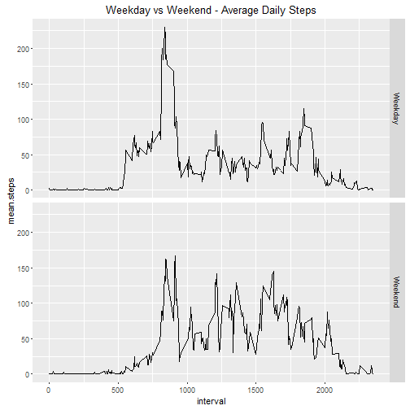

  
#Reproducible Research Assessment 1 - Activity Analysis
  
##Review Criteria  
1. Code for reading in the dataset and/or processing the data
2. Histogram of the total number of steps taken each day
3. Mean and median number of steps taken each day
4. Time series plot of the average number of steps taken
5. The 5-minute interval that, on average, contains the maximum number of steps
6. Code to describe and show a strategy for imputing missing data
7. Histogram of the total number of steps taken each day after missing values are imputed
8. Panel plot comparing the average number of steps taken per 5-minute interval across weekdays and weekends
9. All of the R code needed to reproduce the results (numbers, plots, etc.) in the report

##Setup 

```r
#Open packages
library(plyr)
library(dplyr)
library(tidyr)
library(knitr)
library(ggplot2)

#Set default knitr options
opts_chunk$set(echo = T)
```

## Loading and preprocessing the data (Template Heading)
Download Data and Process Data

```r
#Download and Unzip Data
data.url <- "https://d396qusza40orc.cloudfront.net/repdata%2Fdata%2Factivity.zip"
download.file(data.url,destfile = "activity.zip")
unzip("activity.zip")
activity.data <- read.csv("activity.csv")

head(activity.data)
```

```
##   steps       date interval
## 1    NA 2012-10-01        0
## 2    NA 2012-10-01        5
## 3    NA 2012-10-01       10
## 4    NA 2012-10-01       15
## 5    NA 2012-10-01       20
## 6    NA 2012-10-01       25
```

```r
#Pre-process data with grouped summaries
activity.by.day <- group_by(activity.data, date) %>% summarise(mean.steps = mean(steps, na.rm = T), total.steps = sum(steps, na.rm = T), median.steps = median(steps, na.rm = T))

activity.by.interval <- group_by(activity.data, interval) %>% summarise(mean.steps = mean(steps, na.rm = T), total.steps = sum(steps, na.rm = T), median.steps = median(steps, na.rm = T))
```

## What is mean total number of steps taken per day? (Template Heading)
Total Steps Per Day as Histogram and Table of Daily Statistics

```r
#plot histogram
total.hist <- ggplot() + geom_histogram(data = activity.by.day, aes(total.steps), binwidth = 2000) +
              ggtitle("Histogram of Total Steps Each Data")

print(total.hist)
```


```r
#Generate daily summary (mean, median and also total)
kable(activity.by.day, caption = "Daily Summary Table")
```


|date       | mean.steps| total.steps| median.steps|
|:----------|----------:|-----------:|------------:|
|2012-10-01 |        NaN|           0|           NA|
|2012-10-02 |  0.4375000|         126|            0|
|2012-10-03 | 39.4166667|       11352|            0|
|2012-10-04 | 42.0694444|       12116|            0|
|2012-10-05 | 46.1597222|       13294|            0|
|2012-10-06 | 53.5416667|       15420|            0|
|2012-10-07 | 38.2465278|       11015|            0|
|2012-10-08 |        NaN|           0|           NA|
|2012-10-09 | 44.4826389|       12811|            0|
|2012-10-10 | 34.3750000|        9900|            0|
|2012-10-11 | 35.7777778|       10304|            0|
|2012-10-12 | 60.3541667|       17382|            0|
|2012-10-13 | 43.1458333|       12426|            0|
|2012-10-14 | 52.4236111|       15098|            0|
|2012-10-15 | 35.2048611|       10139|            0|
|2012-10-16 | 52.3750000|       15084|            0|
|2012-10-17 | 46.7083333|       13452|            0|
|2012-10-18 | 34.9166667|       10056|            0|
|2012-10-19 | 41.0729167|       11829|            0|
|2012-10-20 | 36.0937500|       10395|            0|
|2012-10-21 | 30.6284722|        8821|            0|
|2012-10-22 | 46.7361111|       13460|            0|
|2012-10-23 | 30.9652778|        8918|            0|
|2012-10-24 | 29.0104167|        8355|            0|
|2012-10-25 |  8.6527778|        2492|            0|
|2012-10-26 | 23.5347222|        6778|            0|
|2012-10-27 | 35.1354167|       10119|            0|
|2012-10-28 | 39.7847222|       11458|            0|
|2012-10-29 | 17.4236111|        5018|            0|
|2012-10-30 | 34.0937500|        9819|            0|
|2012-10-31 | 53.5208333|       15414|            0|
|2012-11-01 |        NaN|           0|           NA|
|2012-11-02 | 36.8055556|       10600|            0|
|2012-11-03 | 36.7048611|       10571|            0|
|2012-11-04 |        NaN|           0|           NA|
|2012-11-05 | 36.2465278|       10439|            0|
|2012-11-06 | 28.9375000|        8334|            0|
|2012-11-07 | 44.7326389|       12883|            0|
|2012-11-08 | 11.1770833|        3219|            0|
|2012-11-09 |        NaN|           0|           NA|
|2012-11-10 |        NaN|           0|           NA|
|2012-11-11 | 43.7777778|       12608|            0|
|2012-11-12 | 37.3784722|       10765|            0|
|2012-11-13 | 25.4722222|        7336|            0|
|2012-11-14 |        NaN|           0|           NA|
|2012-11-15 |  0.1423611|          41|            0|
|2012-11-16 | 18.8923611|        5441|            0|
|2012-11-17 | 49.7881944|       14339|            0|
|2012-11-18 | 52.4652778|       15110|            0|
|2012-11-19 | 30.6979167|        8841|            0|
|2012-11-20 | 15.5277778|        4472|            0|
|2012-11-21 | 44.3993056|       12787|            0|
|2012-11-22 | 70.9270833|       20427|            0|
|2012-11-23 | 73.5902778|       21194|            0|
|2012-11-24 | 50.2708333|       14478|            0|
|2012-11-25 | 41.0902778|       11834|            0|
|2012-11-26 | 38.7569444|       11162|            0|
|2012-11-27 | 47.3819444|       13646|            0|
|2012-11-28 | 35.3576389|       10183|            0|
|2012-11-29 | 24.4687500|        7047|            0|
|2012-11-30 |        NaN|           0|           NA|

## What is the average daily activity pattern? (Template Heading)
Average Daily Patterns

```r
#plot line chart
daily.average.chart <- ggplot() + geom_line(data = activity.by.interval, aes(interval, mean.steps)) + ggtitle("Average Daily Steps")

print(daily.average.chart)
```


```r
#find maximum interval
max.interval <- activity.by.interval$interval[which.max(activity.by.interval$mean.steps)]
```
The interval that on average has the maximum number of steps is 835.

## Imputing missing values (Template Heading)
Imput Missing Values and Process for Daily and Interval Statistics

Strategy: Loop round rows with missing data and replace with average for the corresponding interval

```r
#Get row numbers with missing steps
missing.rows <- which(is.na(activity.data$steps))

activity.data.corrected <- activity.data

#loop to replace rows with missing values with interval average
for (row in missing.rows) {
  activity.data.corrected$steps[row] <- activity.by.interval$mean.steps[activity.by.interval$interval == activity.data.corrected$interval[row]]
}


activity.corrected.by.day <- group_by(activity.data.corrected, date) %>% summarise(mean.steps = mean(steps, na.rm = T), total.steps = sum(steps, na.rm = T), median.steps = median(steps, na.rm = T))

activity.corrected.by.interval <- group_by(activity.data.corrected, interval) %>% summarise(mean.steps = mean(steps, na.rm = T), total.steps = sum(steps, na.rm = T), median.steps = median(steps, na.rm = T))
```


Total Steps Per Day as Histogram and Table of Daily Statistics

```r
total.hist.corrected <- ggplot() + geom_histogram(data = activity.corrected.by.day, aes(total.steps), binwidth = 2000) +
              ggtitle("Histogram of Total Steps Each Data")

print(total.hist.corrected)
```


## Are there differences in activity patterns between weekdays and weekends? (Template Heading) 
Weekend vs Weekday Analysis using Corrected Dataset

```r
#add weekday and weekend labels
activity.data.corrected$weekday <- weekdays(as.POSIXct(as.character(activity.data.corrected$date)))
activity.data.corrected$label[activity.data.corrected$weekday == "Saturday" | activity.data.corrected$weekday == "Sunday"] <- "Weekend"

activity.data.corrected$label[is.na(activity.data.corrected$label)] <- "Weekday"

activity.data.corrected$label <- factor(activity.data.corrected$label)

activity.week.by.interval <- group_by(activity.data.corrected, label, interval) %>% summarise(mean.steps = mean(steps, na.rm = T), total.steps = sum(steps, na.rm = T), median.steps = median(steps, na.rm = T))

#plot panel plot
activity.panel <- ggplot() + geom_line(data = activity.week.by.interval, aes(interval, mean.steps)) +
                  facet_grid(label~.) + ggtitle("Weekday vs Weekend - Average Daily Steps")

print(activity.panel)
```



It is observed that the weekend activity does not see as high a peak activity level.

